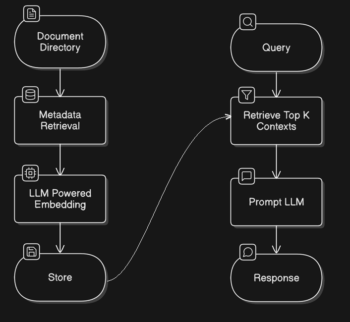

# PaperQA Wrapper Project

## 📄 Project Overview

This project provides a **wrapper around [PaperQA](https://github.com/Future-House/paper-qa)**, an Retrieval-Augmented Generation (RAG) pipeline centred around academic papers. This project aims to make scientific literature more accessible and interactive, enabling researchers to quickly find relevant information from large datasets of academic publications.

This wrapper was specifically written to suit my requirements with minimal setup, allowing seamless integration with any LLM run with ollama or GPT models. The wrapper adds some control over your PDF embeddings, support for reasoning LLMs (like the new DeepSeek R1), and some formatting of the responses.

---

## 🛠 Installation

### 1. Clone the Repository

```bash
git clone https://github.com/yourusername/paperqa-wrapper.git
cd paperqa-wrapper
```

### 2. Set Up Conda Environment

#### Create and Activate Environment

```bash
conda create --name paperqa-env python=3.11
conda activate paperqa-env
```

#### Install Dependencies

```bash
pip install -r requirements.txt
```

### 3. Configure API Keys

To use PaperQA with OpenAI's models or a custom LLM, you need to set up the `OPENAI_API_KEY`:

#### On **Windows**

```bash
set OPENAI_API_KEY=your_openai_api_key
```

#### On **Linux/Mac**

```bash
export OPENAI_API_KEY=your_openai_api_key
```

### 4. Using a Custom LLM with Ollama

For those interested in running a local LLM using [Ollama](https://ollama.com/):

1. **Install Ollama**: Download and install [Ollama](https://ollama.com/download).
2. **Start the LLM**: Use the command `ollama run model_name` to start the model locally.

I wrote this to try out the [DeepSeek R1 model](https://huggingface.co/unsloth/DeepSeek-R1-Distill-Qwen-7B-GGUF/tree/main) but you can run it with any LLM on ollama. The project automatically tries to obtain the running ollama configuration. If you are running multiple models or using a different port, you may need to reconfigure this inside `settings.py` and `utils.py`

---

## 🚀 Usage

The wrapper provides a command-line interface (CLI) for adding documents and querying the database.

### **Add Documents**

Create embeddings from a directory of papers:

```bash
python main.py add --paper_dir /path/to/pdf/folder
```

#### Optional Arguments

- `--paper_dir`: Specify the paper directory. Default: `papers/`
- `--file_path`: Specify the path to load/save the indexed Docs object. Default: `paper_index/docs.pkl`

### **Query the Database**

Ask questions based on indexed documents:

```bash
python main.py query "What are some possible research challenges in deep learning?"
```

#### Optional Arguments

- `--file_path`: Specify the path to load the indexed Docs object. Default: `paper_index/docs.pkl`

### **Global Arguments**

- `--llm [gpt|ollama]`: Specify the LLM configuration to use. Default: `ollama`
- `--verbose [0-3]`: Control verbosity level
- `--ollama_model "model_name"`: Specify a custom model for Ollama
  
---

## ❓ Why Use PaperQA?

Scientific research involves reviewing and analyzing a large number of papers, which can be overwhelming. While AI tools like ChatGPT are popular, simply uploading PDFs to them**does not ensure reliable, source-backed answers**—it only provides general information, which may not come from your own documents.

PaperQA helps solve this problem by allowing you to **ask specific questions directly to your collection of PDFs**. Instead of returning broad, general AI-generated responses, PaperQA finds the most relevant sections from your papers, extracts key information, and presents an answer with proper citations. This ensures that every response is backed by sources you provide.

  
*Automatically generated using [eraser.io](https://www.eraser.io/diagramgpt)*

---

## 📝 Ending Notes

This project includes a forked version of PaperQA with a slight modification to handle specific edge cases related to LLM response formatting. This version is added as a submodule within this repository which allows users to get the necesssary modifications without manually altering the original code.

Visit the original [repository](https://github.com/example/paperqa) for understanding its capabilities and further customization options.

## References

[1] Lála, Jakub, et al. "PaperQA: Retrieval-Augmented Generative Agent for Scientific Research." arXiv preprint arXiv:2312.07559, 2023.

[2] Skarlinski, Michael D., et al. "Language Agents Achieve Superhuman Synthesis of Scientific Knowledge." arXiv preprint arXiv:2409.13740, 2024
